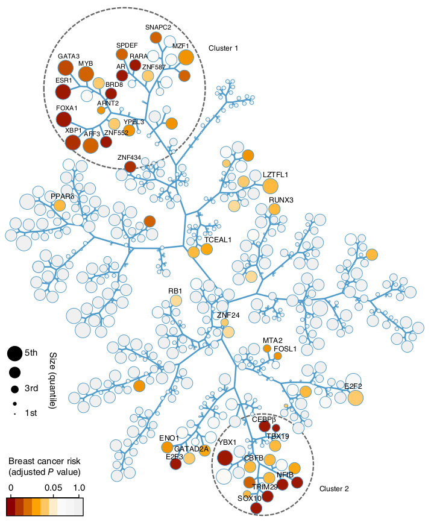

# TreeAndLeaf 
A R package for reorganizing dendrograms and adding additional layers of information.

<p align="center">
  
</p>

<p align="center">
Source: Castro, 2015 (http://dx.doi.org/10.1038/ng.3458)
</p>


## Installation
Install TreeAndLeaf from github

```{r}
if (! requireNamespace("devtools", quietly = TRUE))
install.packages("devtools")
devtools::install_github("luisrizzardi/TreeAndLeaf", force = TRUE, build_vignettes = TRUE)
```

For more info on how to use the package, check its vignette:

```{r}
vignette("TreeAndLeaf")
```