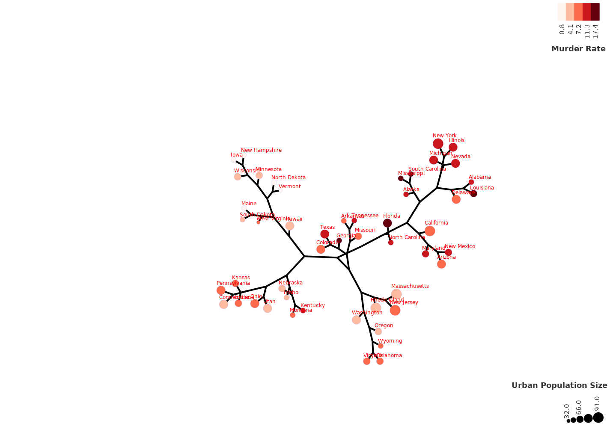
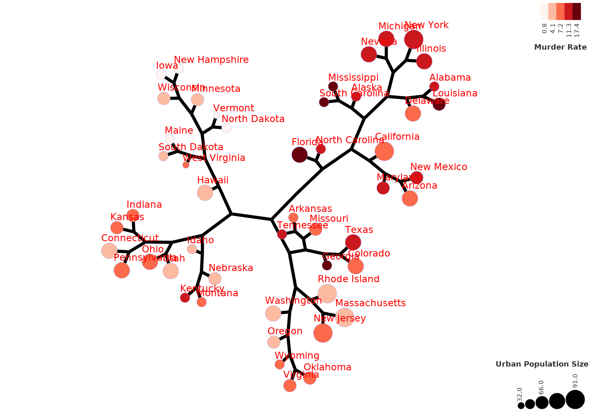
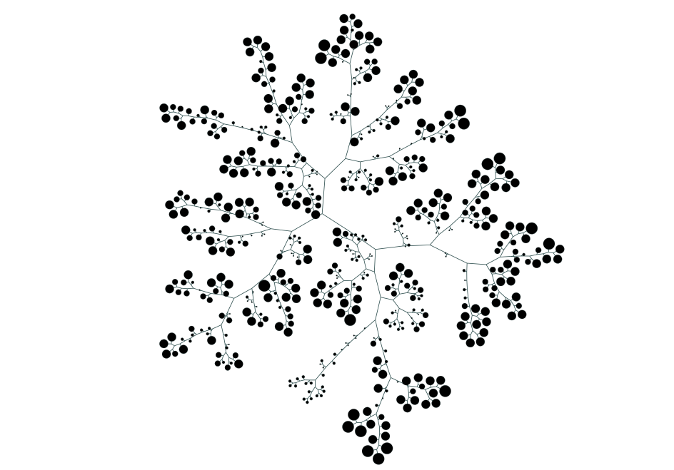

# TreeAndLeaf 
A R package for reorganizing dendrograms and adding additional layers of information.

<p align="center">
  
</p>

<p align="center">
Source: Castro, 2015 (http://dx.doi.org/10.1038/ng.3458)
</p>


## Installation
Install TreeAndLeaf from github

```{r}
if (! requireNamespace("devtools", quietly = TRUE))
install.packages("devtools")
devtools::install_github("luisrizzardi/TreeAndLeaf", force = TRUE)
```

## Small Tree Example

1 - Call the necessary libraries

```{r}
library(TreeAndLeaf)
library(igraph)
library(RedeR)
library(RColorBrewer)
```

2 - Clusterize the data from the dataset "USArrests" and transform it into an igraph object

```{r}
hc <- hclust(dist(USArrests), "ave")
gg <- hclust2igraph(hc)
```

3 - Format the igraph for better visualization in RedeR

```{r}
gg <- formatTree(gg = gg,
                 dataframe = USArrests,
                 nodeColor = "Murder",
                 nodeSize = "UrbanPop",
                 theme = "SSReds")
```

4 - Call the RedeR interface and add the legends

```{r}
rdp <- RedPort()
calld(rdp)

# Add the legends
addLegend.color(obj = rdp,
                gg,
                title = "Murder Rate",
                position = "right")

addLegend.size(obj = rdp,
               gg,
               title = "Urban Population Size",
               position = "bottomright")
```

5 - Call treeAndLeaf

```{r}
treeAndLeaf(rdp, gg, size = "small")
```
<p align="center">

</p>

At this stage the image produced needs small ajustments to solve the residual edge crossings.
You can just click and drag a node to ajust it while the relaxation algorithm is still running.

6 - After the manual adjustments, you can relax a second time with different parameters to condense the nodes. You can do this using the window opened in RedeR when you called treeAndLeaf. Try lowering p1 to 20, p3 to 30 and p8 to 30.

<p align="center">

</p>

## Large Tree Example

1 - Call the necessary libraries

```{r}
library(TreeAndLeaf)
library(igraph)
library(RedeR)
library(RColorBrewer)
```

2 - Load the igraph from the package data
```{r}
data(gg)
```

3 - Add some formatting for aesthetic purposes
```{r}
E(gg$g)$edgeWidth <- 50
E(gg$g)$edgeColor <- "darkslategray"
```

4 - Call the RedeR interface and add the tree

```{r}
rdp <- RedPort()
calld(rdp)
treeAndLeaf(rdp, gg$g, size = "large")
```

<p align="center">

</p>

After some seconds, you should get the result from the image above.
At this stage, select big groups of nodes overlaping, move them and update/relax again. 
Repeat this process until all overlaps are solved.

The resulting tree should look like the one below. From now on, you are free to try new relax parameters in RedeR combinations until you get the desired result.

<p align="center">

</p>

## Notes About Manual Usage

1 - Instead of using the premade themes offered by formatTree, you may also use them as a base to change some or all parameters for the ones you desire. For more information on what you can do, use the help file (?formatTree).

2 - It is also possible to set each tree attribute manually. This will give you more formatting options and more flexibility. However, you will also need to resize the intermediate nodes to make them "invisible". For more information on what igraph attributes RedeR is able to read, see the help file for addGraph function (?addGraph).

3 - If you want to use treeAndLeaf function just to get the layout and make your own use of addGraph and relax, you may use the function like the example below.

```{r}
layout <- treeAndLeaf(rdp, gg$g, showgraph = FALSE)
```

